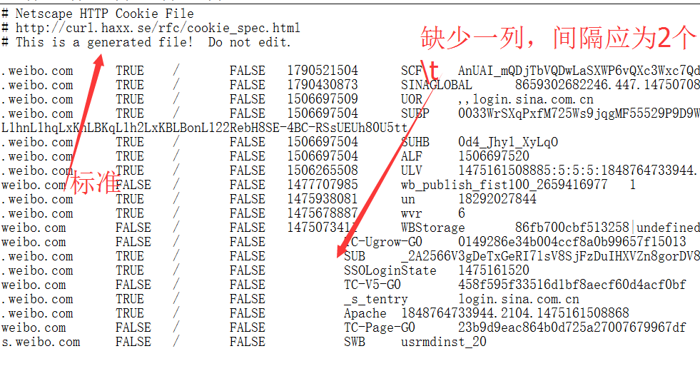
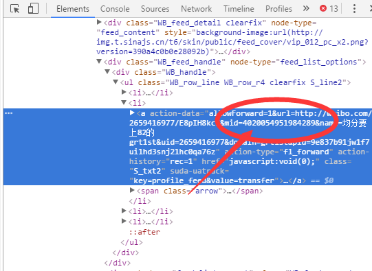

# exercise
#####一些小项目，放在这里~
###目录
####0x00  微博助手   

0x00.微博助手  
--------

+ python需要rsa库

+ 功能：发微博(可配图)，转发微博

+ 登陆方式：账号、密码 || cookie（cookie文件基本格式：

+ 发送微博：修改参数text，可以用"#话题#"与"@人"。

+ 微博配图：修改参数pic，无图为[],有图为['路径']，支持多配图（目前只支持jpg

+ 转发微博：参数repost_text为转发的文本，参数mid为转发微博的mid，开发者模式下查看

